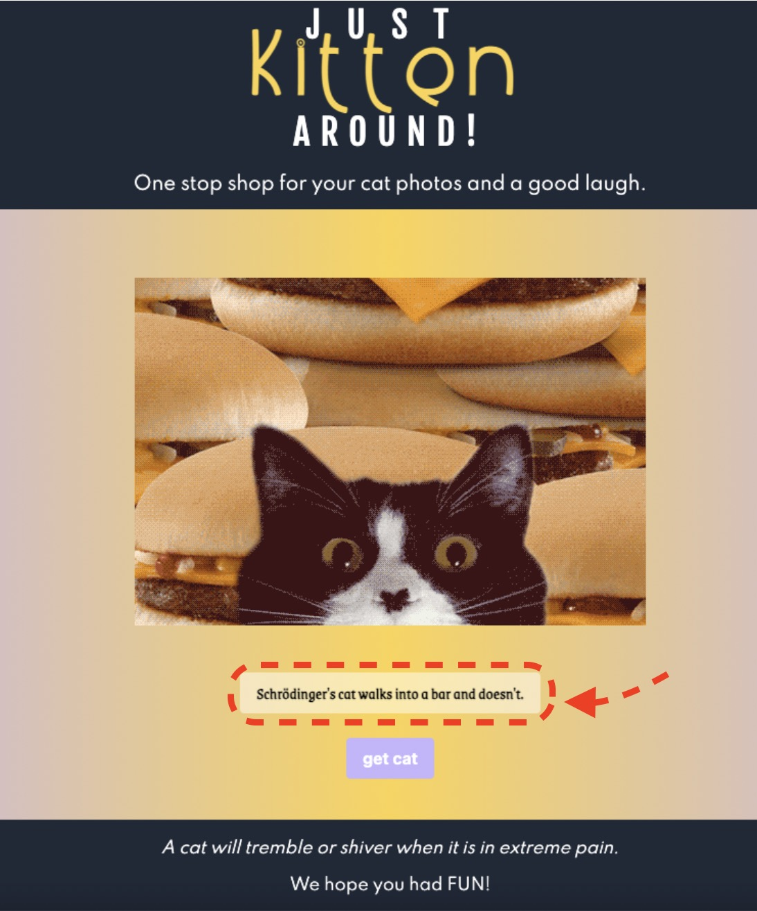
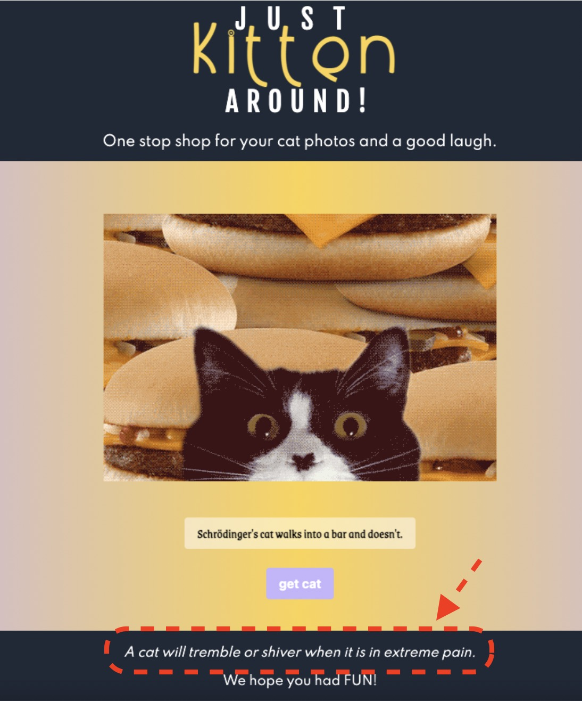
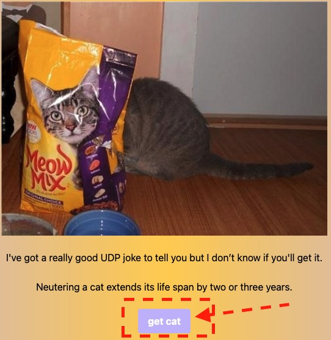

* **Just Kitten Around!**  
 
The Cute and Funny "Just Kitten Arround" Page is made for people who love cats and like some fun and learning more about cats along the way.

**Description**

* _This application displays random cat pictures accompanied with jokes and some cat-facts._
* _When user clicks the button, the page will display a random picture of a cat, a joke and random fact about cats for some purrrr-fect fun time!_
* _While cat pictures invoke warm feelings, jokes will 'crack you open' and cat-fact will expand your knowledge about cats!_ 
* _And last but not the least, 'get cat' button is there for more fun to come- user just needs to click it and will be rewarded with more fun with our **Just Kitten Around!** page_

### **Purpose**
* _This page is meant for pure fun with cute cat pictures, funny jokes and some serious facts about our lovely cats_

### **Built With**
* _HTML_
* _CSS/Tailwind_
* _Javascript_
* _Cat API_
* _Joke API_

### **Link to project launched on GitHub Pages:**
*https://likica.github.io/kitty_translator/*

### **Screenshots ...more coming...**
<h3 align="center" width="100%">
 1. Landing Page
   

    

2. Random image of a cat
   

    

3. Random Joke
   

    

4. Random Fact about cats
   

    

5. Use get_cat Button to get more!
   

    

### **_Contribution_**
Made by Fahrija Wyroski, Emily Crook, Katie Redford, & Becca Wyland