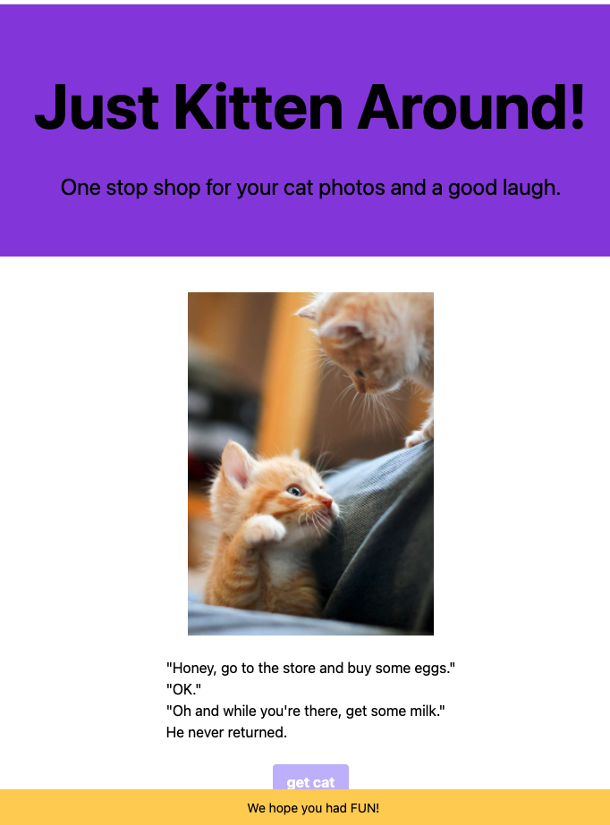

Cute and Funny! The "kitty_translator"

### **Description**
* _This application displays cat pictures accompanied with jokes._
* _When user clicks the button, the page will display a random picture of a cat and a joke for some purrrr-fect fun time!_
* _While cat pictures invoke warm feelings, jokes will 'crack you open' LOL_

### **Purpose**
* _This page is meant for pure fun with cute cat pictures and funny jokes_

### **Built With**
* _HTML_
* _CSS/Tailwind_
* _Javascript_
* _Cat API_
* _Joke API_

### **Link to project launched on GitHub Pages:**
*https://likica.github.io/kitty_translator/*

### **Screenshots ...more coming...**
<h3 align="center" width="100%">
 1. LANDING PAGE
   

    

### **_Contribution_**
Made by Fahrija Wyroski, Emily Crook, Katie Redford, & Becca Wyland

